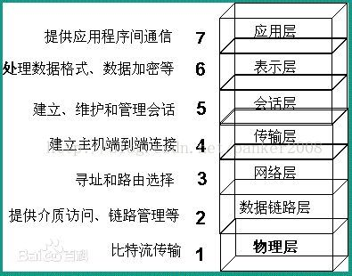
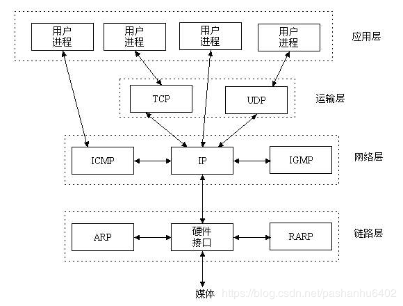
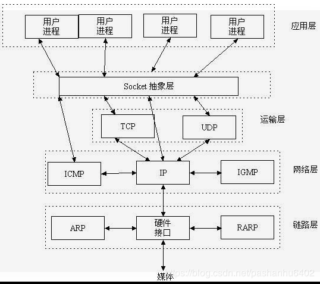
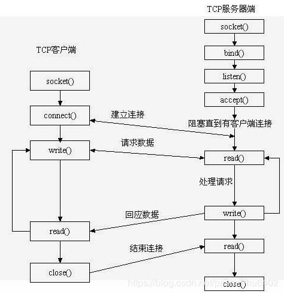

# 目录
一、网络七层模型

二、TCP/IP协议簇

三、Socket的位置和作用

四、三次握手与四次分手

五、TCP连接的状态机

六、常用函数

七、简单例子

八、tcpdump观察

# 一、网络七层模型
 

# 二、TCP/IP协议簇
&emsp; TCP/IP协议不仅仅指的是TCP 和IP两个协议，而是指一个由FTP、SMTP、TCP、UDP、IP等协议构成的协议簇， 只是因为在TCP/IP协议中TCP协议和IP协议最具代表性，所以被称为TCP/IP协议。
 
 
&emsp; 应用层：应用层是TCP/IP协议的第一层，是直接为应用进程提供服务的。

（1）对不同种类的应用程序它们会根据自己的需要来使用应用层的不同协议，邮件传输应用使用了SMTP协议、万维网应用使用了HTTP协议、远程登录服务应用使用了有TELNET协议。 [1] 

（2）应用层还能加密、解密、格式化数据。 [1] 

（3）应用层可以建立或解除与其他节点的联系，这样可以充分节省网络资源。 [1] 

&emsp; 运输层：作为TCP/IP协议的第二层，运输层在整个TCP/IP协议中起到了中流砥柱的作用。且在运输层中，TCP和UDP也同样起到了中流砥柱的作用。 [1] 

&emsp; 网络层：网络层在TCP/IP协议中的位于第三层。在TCP/IP协议中网络层可以进行网络连接的建立和终止以及IP地址的寻找等功能。 [1] 

&emsp; 网络接口层：在TCP/IP协议中，网络接口层位于第四层。由于网络接口层兼并了物理层和数据链路层所以，网络接口层既是传输数据的物理媒介，也可以为网络层提供一条准确无误的线路。

TCP数据报结构 $\color{red}{TODO，画出数据报的结构}$

# 三、Socket的位置和作用

Socket 是应用层与TCP/IP协议簇之间的接口，TCP/IP协议簇的实现细节对于应用层不可见，应用层只需要知道Socket接口就可以组装数据与对端进行通信。
网络中的进程使用ip，port，协议即可唯一的定位，socket用三元组可以为网络：w:w
网络中的进程搭建一条通信的链路。

一个标准的简单的建立socket的交互如下所示。

其中socket是在设置通信协议。bind是在绑定ip和端口。listen是在监听这个socket是否有连接接入。accept是已经有连接接入，并且创建一条新的fd用于读写数据。

# 四、建立连接
为何是三次握手，而不是两次或者四次
TCP是建立可靠的全双工数据传输。需要确认双向都可以传输数据。通过Req和Ack建立有效连接。Req每次建立连接时是新创建的序列。连接的双方都会创建新的Req，两个Req是通过ACK匹配的。如果ACK不是Req+1，说明收到的包并不是属于这条连接。
假设TCP是两次握手建立连接，如A向B发起建立，B向A回报。这里会存在两个问题，即B向A发送包是否可以顺利到达，另一方面A向B发起建立连接可能是之前建立连接的延迟包。如果是三次握手，A向B发起，B向A回报，A再次用Ack准确的回包，即可说明A向B发起是本次建立连接的包，而不是之前延迟的包。因为B的Req是每次建连接都会重新创建。这里的本质问题是序列号没有绑定整个网络的全局时钟。

# 五、断开连接
为何是四次握手，而不是三次或者两次
4次握手，是因为TCP是全双工通信5，一方断开连接，另一方仍然可以发送数据，只有双方都断开连接才是真的断开了。因此是四次。

# 六、状态机
交互图，和状态图

# 七、TimeWait状态

# 八、常用函数

# 九、简单例子

# 十、抓包工具

# 参考
https://blog.csdn.net/pashanhu6402/article/details/96428887
https://blog.csdn.net/weixin_39634961/article/details/80236161
https://www.jianshu.com/p/066d99da7cbd
https://www.cnblogs.com/baiduboy/p/8127913.html
